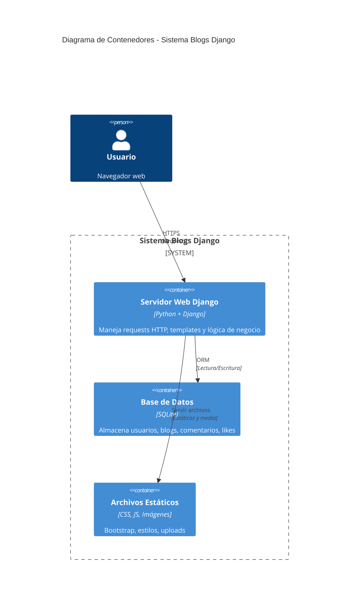

# Diagrama C4 - Contenedores

```mermaid
C4Container
  title Diagrama de Contenedores - Sistema Blogs Django

  Person(usuario, "Usuario", "Navegador web")

  System_Boundary(sistema, "Sistema Blogs Django") {
    Container(web, "Servidor Web Django", "Python + Django", "Maneja requests HTTP, templates y lógica de negocio")
    Container(db, "Base de Datos", "SQLite", "Almacena usuarios, blogs, comentarios, likes")
    Container(static, "Archivos Estáticos", "CSS, JS, Imágenes", "Bootstrap, estilos, uploads")
  }

  Rel(usuario, web, "HTTPS", "Requests")
  Rel(web, db, "ORM", "Lectura/Escritura")
  Rel(web, static, "Servir archivos", "Estáticos y media")
```
