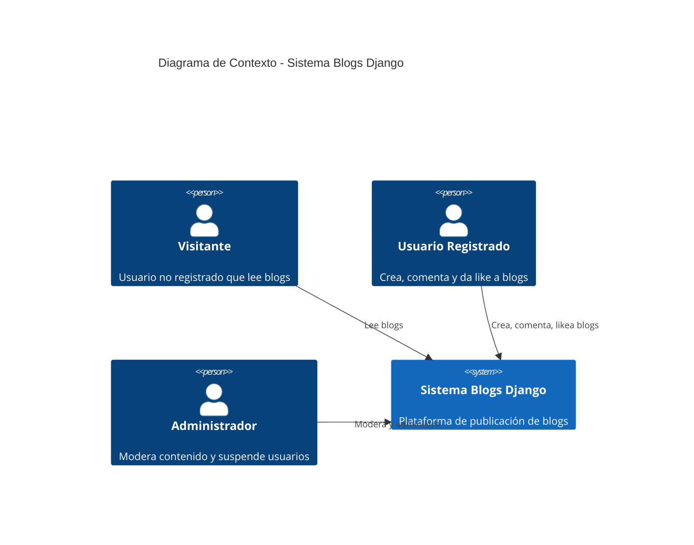

# Diagrama C4 - Contexto del Sistema

```mermaid
C4Context
  title Diagrama de Contexto - Sistema Blogs Django

  Person(visitante, "Visitante", "Usuario no registrado que lee blogs")
  Person(usuario, "Usuario Registrado", "Crea, comenta y da like a blogs")
  Person(admin, "Administrador", "Modera contenido y suspende usuarios")

  System(sistema, "Sistema Blogs Django", "Plataforma de publicación de blogs")

  Rel(visitante, sistema, "Lee blogs")
  Rel(usuario, sistema, "Crea, comenta, likea blogs")
  Rel(admin, sistema, "Modera y administra")
```
